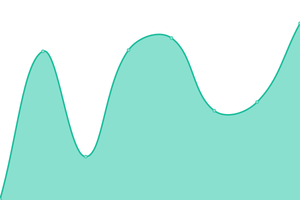
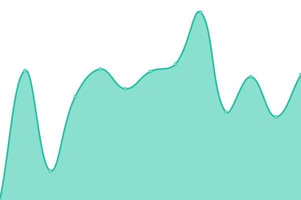

# [📈 Live Status](https://karlos528.github.io/fe): <!--live status--> **🟩 All systems operational**

This repository contains the open-source uptime monitor and status page for [karlos528](https://karlos528.github.io/fe), powered by [Upptime](https://github.com/upptime/upptime).

With [Upptime](https://upptime.js.org), you can get your own unlimited and free uptime monitor and status page, powered entirely by a GitHub repository. We use [Issues](https://github.com/karlos528/fe/issues) as incident reports, [Actions](https://github.com/karlos528/fe/actions) as uptime monitors, and [Pages](https://karlos528.github.io/fe) for the status page.

<!--start: status pages-->
<!-- This summary is generated by Upptime (https://github.com/upptime/upptime) -->
<!-- Do not edit this manually, your changes will be overwritten -->
<!-- prettier-ignore -->
| URL | Status | History | Response Time | Uptime |
| --- | ------ | ------- | ------------- | ------ |
|  [HKA FE v4](https://emision21v4.thefactoryhka.com.co/ws/v1.0/Service.svc) | 🟩 Up | [hka-fe-v4.yml](https://github.com/karlos528/fe/commits/HEAD/history/hka-fe-v4.yml) | 

 150ms
     
 | 

<a href="https://karlos528.github.io/fe/history/hka-fe-v4">100.00%</a>
    

|  [HKA FE v2](https://emision21v2.thefactoryhka.com.co/ws/v1.0/Service.svc) | 🟩 Up | [hka-fe-v2.yml](https://github.com/karlos528/fe/commits/HEAD/history/hka-fe-v2.yml) | 

 150ms
     
 | 

<a href="https://karlos528.github.io/fe/history/hka-fe-v2">100.00%</a>
    

|  [DIAN](https://www.dian.gov.co) | 🟩 Up | [dian.yml](https://github.com/karlos528/fe/commits/HEAD/history/dian.yml) | 

 719ms
     
 | 

<a href="https://karlos528.github.io/fe/history/dian">100.00%</a>
    

|  [Habilitación](https://catalogo-vpfe-hab.dian.gov.co/User/Login) | 🟩 Up | [habilitacion.yml](https://github.com/karlos528/fe/commits/HEAD/history/habilitacion.yml) | 

 281ms
     
 | 

<a href="https://karlos528.github.io/fe/history/habilitacion">100.00%</a>
    

|  [Producción](https://catalogo-vpfe.dian.gov.co/User/Login) | 🟩 Up | [produccion.yml](https://github.com/karlos528/fe/commits/HEAD/history/produccion.yml) | 

 247ms
     
 | 

<a href="https://karlos528.github.io/fe/history/produccion">100.00%</a>
    

<!--end: status pages-->

[**Visit our status website →**](https://karlos528.github.io/fe)

## 📄 License

- Powered by: [Upptime](https://github.com/upptime/upptime)
- Code: [MIT](./LICENSE) © [karlos528](https://karlos528.github.io/fe)
- Data in the `./history` directory: [Open Database License](https://opendatacommons.org/licenses/odbl/1-0/)
